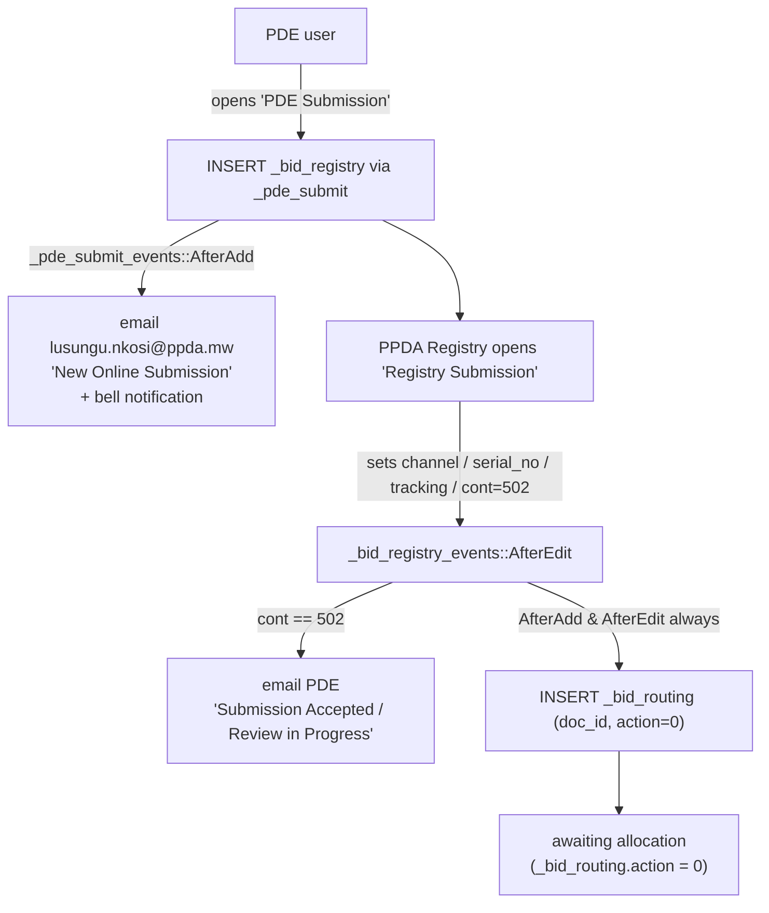
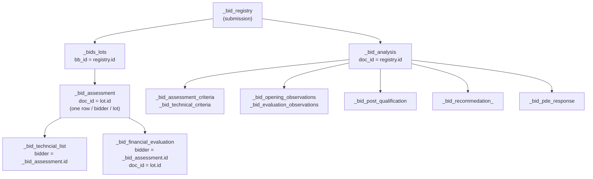
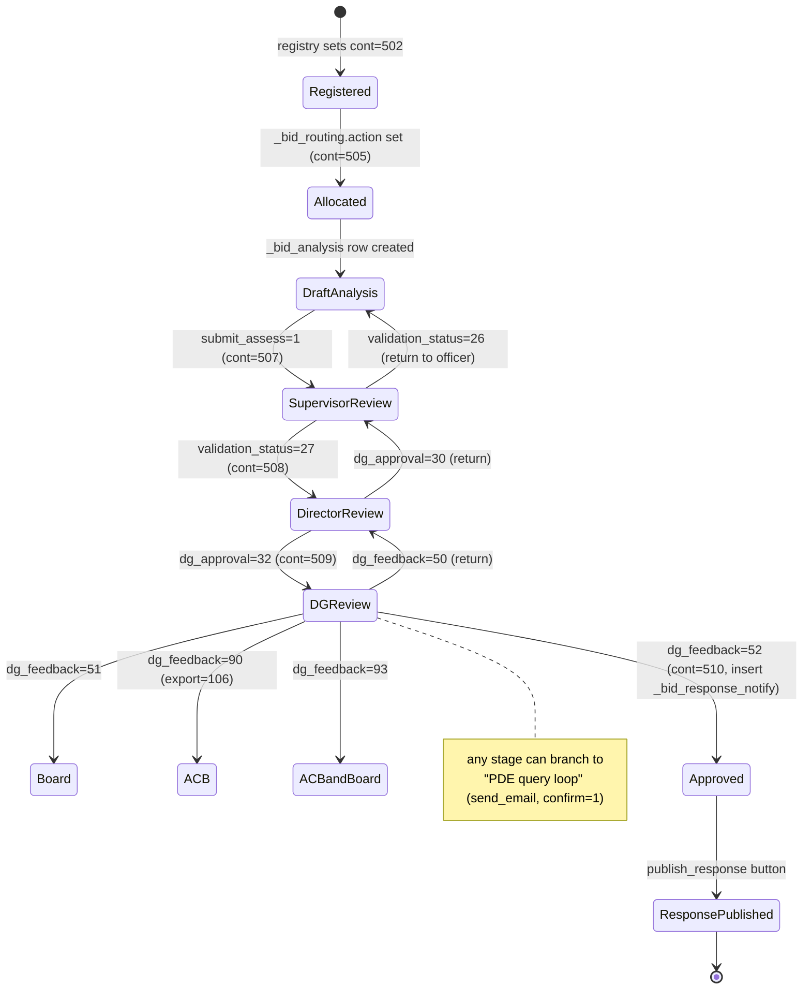
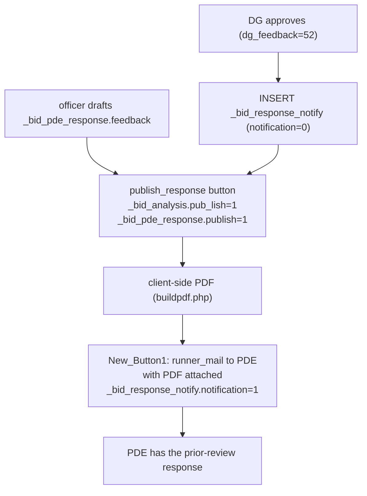

# PPDA e‑Services — Legacy process flows & rebuild mapping

Reference documentation for the **prior‑review / bid‑analysis** workflow of the legacy PPDA
e‑Services system, reconstructed from source, and mapped to the native rebuild under
`app/eservice/`.

---

## 1. Overview

### What this is

The legacy system (`/home/emmmwinama/Projects/ppda-eservices`, ~947 PHP files, PHPRunner‑generated,
single MariaDB schema) has no written description of how a Procuring & Disposing Entity (PDE)
submission travels from lodgement to a published prior‑review response. Its business logic is
spread across `include/<page>_events.php` handlers, grid‑tab `WHERE` clauses, integer status
codes that dereference a lookup table, and email subject lines. This document pulls that
together into one flow narrative and maps every stage / table / status to its equivalent in
the new build, flagging what has not yet been rebuilt.

### Scope

**In scope:** the "Submissions & Tracking" pipeline — PDE submission → registry acceptance →
allocation → bid analysis (opening, technical, financial) → supervisory / director / DG /
board / ACB review → PDE response letter → award reporting.

**Out of scope (excluded):** supplier registration, supplier validation & approval, supplier
certificate generation, and levy management. That is the "Supplier Registration" and "Levy
Management" menu groups and every `_supplier_*`, `_validation_form*`, `_levy_*` page and table.

### How to read it

Each stage section (§4–§8) describes the **legacy behaviour** first, then ends with a
**"→ New build"** call‑out. §9 is the consolidated legacy‑to‑new mapping table. §10–§11 are
reference appendices (email triggers, RBAC). §12 is the rebuild backlog.

### Source‑of‑truth caveat

The legacy schema file `ppda_e_services-online.sql` is **structure only** — it contains no
`INSERT` rows. The `_parameters` / `_bid_parameters` lookup tables that decode every integer
status column are therefore empty in the repo. Status‑code meanings below are **reconstructed
from event code, grid‑tab names, and email subjects**, not read from data. Where a code's
meaning is inferred it is marked *(inferred)*.

---

## 2. Actors & roles

All human actors — PDE staff and PPDA staff alike — are rows in the single PHPRunner users
table `supplier_registration_ppda_users` (`ID, username, password, email, fullname, groupid,
active, organisation, officer_position, _officers_pde, notification_mode set('SMS','Email',
'WhatsApp','None'), two_factor`). PDE staff self‑register through `register.php`.

| Actor | Legacy identity | Role in the pipeline |
|---|---|---|
| **PDE user** | user account, `organisation` / `_officers_pde` set; PDE master row in `_bid_ppdes` | Lodges a submission (`_pde_submit`), tracks it, answers PPDA queries. Sees only its own submissions until they lock. |
| **PPDA Registry** | user account (e.g. `lusungu.nkosi@ppda.mw`) | Receives the new‑submission email, opens `_bid_registry`, validates completeness, registers/accepts it, assigns a serial number. |
| **DG office / allocator** | user account | Opens `_bid_routing` ("Task Allocation"), assigns the submission to a technical officer with written instructions. |
| **Technical Officer (Reviewer)** | `_bid_analysis.officer` = their `ID`; also listed in `_bid_ppda_officers` / the `_bid_technical_officers` view | Performs the whole bid analysis (opening, technical, financial, observations, recommendation), then submits for review. |
| **Supervisor** | `_bid_analysis.supervisor` = their `ID` | Endorses the analysis to the Director, or returns it to the officer. |
| **Director** | `_bid_analysis.supervisor_2` = their `ID` | Endorses to the DG, or returns it to the Supervisor. |
| **Director General (DG)** | user account | Final decision: approve (grant/withhold no‑objection), return, or escalate to the Board and/or the Anti‑Corruption Bureau. |
| **PPDA Board** | user account | Board‑level review of escalated submissions (`_bid_analysis_board`, `_ppda_bid_analysis_board`). |
| **Anti‑Corruption Bureau (ACB)** | external; notified by email | Vetting under PPD Act s.37(11) for submissions the DG escalates. |
| **Admin** | `ACCESS_LEVEL_ADMIN = "Admin"` | Maintains PDE entities, parameters, notification banners, signatures, CC lists. |

### Structural fact — one table, many "role pages"

There are **no separate supervisor/director/dg/board/acb tables**. Every `_bid_analysis_<role>`
page (`_bid_analysis_supervisor`, `_bid_analysis_director`, `_bid_analysis_dg`,
`_bid_analysis_board`, `_bid_analysis_acb`, `_bid_analysis_approval`, `_bid_analysis_validation`,
`_bid_analysis_tracking`, `_ppda_bid_analysis_board`) is a PHPRunner **view over the single
`_bid_analysis` table** (`.OriginalTable = "_bid_analysis"` in each `_settings.php`). They
differ only by:

* the grid **SQL** (which columns / joins are shown),
* the grid **tab `WHERE`** clauses (which lifecycle states appear in which worklist bucket),
* the **`.OwnerID`** setting — PHPRunner "own records only" scoping, pointed at a different
  user‑id column per role (`officer`, `supervisor`, `supervisor_2`).

Likewise `_pde_submit`, `_bid_registry` and `_submit` are three page‑skins over the one
`_bid_registry` table.

---

## 3. Navigation map

From `include/menunodes_main.php`. The pipeline is one menu group, "Submissions & Tracking"
(node id 15). The three page‑skins over `_bid_registry` and the many role‑views over
`_bid_analysis` all appear as separate leaves.

| Menu label | Bound table | Purpose |
|---|---|---|
| PDE Submission | `_pde_submit` → `_bid_registry` | PDE captures a new submission |
| Registry Submission | `_bid_registry` | PPDA registry validates & registers it |
| Task Allocation | `_bid_routing` | DG assigns it to a technical officer |
| Technical Review & Checklist | `_bid_analysis` | officer's working view of the analysis |
| Supervisory Reviews & Approvals | `_bid_analysis_supervisor` | supervisor worklist |
| Director Reviews and Approvals | `_bid_analysis_director` | director worklist |
| DG Reviews and Approvals | `_bid_analysis_dg` | DG worklist + decision |
| PPDA Board Review | `_bid_analysis_board` | board worklist |
| Anti‑Corrruption Bureau *(sic)* | `_bid_analysis_acb` | ACB vetting worklist |
| Prior Review Notification | `_bid_response_notify` | approved‑letter dispatch worklist |
| Submission Tracking Service | `_bid_analysis_tracking` | read‑only end‑to‑end trail |
| Supplier Tracking Service | `_bid_participation` | read‑only participation & results grid |
| AVG Prior Completion Report | `_bids_performance_individual_chart` | reviewer turnaround KPI |

Relevant "Settings" leaves (nodes 45–51): **PDE Entities** (`_bid_ppdes`), bid parameters
(`_bid_parameters`), **Notifications** (`_ppda_notifications`, admin banner text),
**Supplier Parameters** (`_parameters`, the global lookup catalogue), **CC Responses Address**
(`_bid_response_cc`), **Signature Management** (`_ppda_bid_captcha_link`).

> `_submit` (a legacy duplicate of the registry form) has **no menu node** — it is reachable
> only by direct URL, but it still fires its `AfterAdd` / `AfterEdit` events (email +
> `_bid_routing` insert).

---

## 4. Stage A — Submission intake

### 4.1 Three pages, one table

`include/*_variables.php` shows all three intake pages resolve to the same physical row:

| Page (menu label) | `$strOriginalTableName` | Role |
|---|---|---|
| `_pde_submit` ("PDE Submission") | `_bid_registry` | PDE‑facing capture form |
| `_bid_registry` ("Registry Submission") | `_bid_registry` | PPDA registry acceptance form (joins `_bid_routing`) |
| `_submit` (orphan) | `_bid_registry` | legacy duplicate of the registry form |

### 4.2 `_bid_registry` schema

| Column | Type | Notes |
|---|---|---|
| `id` | int PK | |
| `pde` | int | **FK → `_bid_ppdes.id`** (`fk_registry`, CASCADE) |
| `submission_details` | mediumtext | free‑text title of the submission |
| `accompanied_documents` | varchar(200) | lookup → `_bid_parameters` §1 |
| `submission_signed` | int | lookup → `_bid_parameters` §4 (Yes/No) |
| `date_of_signing` | date | |
| `ref_code_pde` | varchar(100) | PDE's own reference |
| `tender_number` | varchar(200) | |
| `tracking` | varchar(80) | display/tracking status, lookup → `_bid_parameters` §3. `11` = locked *(inferred)* — PDE can no longer edit |
| `user` | varchar(11) | creating user (readonly on form) |
| `level_importance` | varchar(15) | DEFAULT `'Normal'`, lookup → `_bid_parameters` §2 |
| `attachements` *(sic)* | mediumtext | document‑upload control |
| `channel` | int | intake channel, lookup → `_parameters` §2000. `501` = portal/online *(inferred)* |
| `cont` | int | **master workflow‑stage counter**, lookup → `_parameters` §999 (registry form restricted to `id < 505`) |
| `is_part_of_procure_plan` | int | lookup → `_parameters` (`id` 454/455 = Yes/No) |
| `serial_no` | varchar(100) | PPDA serial, assigned at registration |
| `ts_create`, `ts_update` | datetime | |
| `restart` | varchar(50) | `"1"` → re‑route the submission (see 4.3) |

### 4.3 Flow



1. **PDE lodges.** Row inserted through `_pde_submit`. `include/_pde_submit_events.php::AfterAdd`:
   emails `lusungu.nkosi@ppda.mw` from `e-services@ppda.mw`, subject **"New Online Submission -
   PPDA e-Services"** (body: PDE name, submission name); `addNotification(...)` raises an in‑app
   bell notification linking to the `_bid_registry` view.
2. **Registry accepts.** PPDA registry opens `_bid_registry`, checks the pack, fills
   `channel` / `serial_no` / `tracking`, and sets `cont = 502` (registered/accepted).
   `include/_bid_registry_events.php::AfterEdit` — when `cont == "502"` — emails the PDE
   (`pde_email` from `_bid_ppdes`), subject **"PPDA Notification: Submission Accepted"**
   ("…registered on the e‑Services Portal… you will be alerted on progress"). On every add/edit
   it also runs `DB::Insert("_bid_routing", ["doc_id" => $values["id"]])` — so a routing row
   with `action = 0` (unassigned) always exists.
   *(The legacy `_submit` page does the same and additionally notifies
   `edington.chilapondwa@ppda.mw`, subject "New Review Submission - PPDA e-Services".)*
3. **Re‑open.** If `restart == "1"` on a later edit, `AfterEdit` runs
   `DB::Update("_bid_routing", ["action"=>0, "re-submission"=>1], ["doc_id"=>id])` — clearing
   the assigned officer so the submission goes back into the allocation queue.

### 4.4 Status fields

| Field | Meaning | Known values *(all inferred from code)* |
|---|---|---|
| `cont` (`_parameters` §999) | master stage counter, mirrored downstream | `< 505` intake · `502` registered · `505` allocated to officer · `507` in supervisory review · `508` with director · `509` with DG · `510` DG‑approved |
| `channel` (`_parameters` §2000) | how the submission arrived | `501` = online/portal (only these expose the extra `grid_edit1` action on the registry list) |
| `tracking` (`_bid_parameters` §3) | display status | `11` = locked (PDE list edit button hidden) |
| `level_importance` (`_bid_parameters` §2) | priority | DEFAULT `'Normal'` |
| `restart` | re‑route trigger | `"1"` |

### 4.5 → New build

| Legacy | New build |
|---|---|
| `_bid_registry` (via `_pde_submit` / `_bid_registry` / `_submit`) | **`es_bid_registry`** — one table, forms rendered dual‑mode (`bid_registry_form.php`) |
| `accompanied_documents` (`_bid_parameters` §1 lookup) | **`es_bid_registry.accompanied_documents`** `SET(...)` — fixed checklist (IPDC minutes, evaluation report, original bidding document, advert, contract, treasury authorisation, financial/technical proposal, bidder bid documents, general submission) via `es_accompanying_docs()`; the registry‑check panel shows declared‑vs‑uploaded |
| `attachements` (blob/manifest) | **`es_bid_attachment`** (`registry_id`, `kind='submission'`) — real file upload in the form, streamed by `bid_attachment.php` |
| `cont` milestone integers | **`es_bid_registry.status`** ENUM `pending_registry, returned_to_pde, pending_allocation, assigned, in_analysis, completed, closed, withdrawn` |
| "who keyed it" — PDE portal vs PPDA registry | **`es_bid_registry.origin`** ENUM `('registry','pde')`; `received_by` holds the keying user |
| informal "registry checks the pack" (done via `cont`, no gate) | **explicit registry completeness check** — `bid_registry_check.php`: `pending_registry` → approve → `pending_allocation` (stamps `registry_checked_by/at/comment`), or return → `returned_to_pde` (comment required) |
| auto `_bid_routing` insert on every save | no shadow row; allocation is its own explicit step (§5) |
| `_pde_submit` visibility (own PDE only) | **`es_pde_scope()`** — PDE users see only their own PDE's rows; registry submissions (`origin='registry'`) skip the check and start at `pending_allocation` |

---

## 5. Stage B — Allocation (routing) → analysis creation

### 5.1 `_bid_routing` schema

| Column | Type | Notes |
|---|---|---|
| `id` | int PK | |
| `doc_id` | int | **FK → `_bid_registry.id`** (`fk_route_submission`, CASCADE) |
| `date` | date | allocation date |
| `action` | int | **assigned officer**. `0` / NULL = unassigned; `> 0` = a `supplier_registration_ppda_users.ID`. Form lookup uses the `_bid_technical_officers` view (`WHERE ID > 0`) |
| `user` | varchar(20) | who did the routing |
| `comments` | varchar(200) | written instructions to the reviewer |
| `ts_create`, `ts_update` | timestamp | |
| `re-submission` | varchar(50) | `1` when the submission was restarted |

Grid tabs (`_bid_routing_settings.php`): `action = 0 OR action IS NULL` → **"New Document
Submissions"**; `action > 0` → **"Reviews in Progress"**. The list also polls for new rows via
AJAX and shows a badge.

### 5.2 The pivot — `include/_bid_routing_events.php::AfterEdit`

When the DG saves an officer onto a routing row:

```php
$data = array();
$data["r_id"]    = $values["id"];        // routing row id
$data["officer"] = $values["action"];    // the chosen reviewer (user ID)
$data["doc_id"]  = $values["doc_id"];    // the _bid_registry submission id
DB::Insert("_bid_analysis", $data);      // <<< the submission becomes a BID ANALYSIS here

$data = array(); $keyvalues = array();
$data["cont"] = 505;                      // stage: allocated to reviewer
$keyvalues["id"] = $values["doc_id"];
DB::Update("_bid_registry", $data, $keyvalues);

// email the reviewer (block is duplicated in the source)
// to: $values["email_r"], from: e-services@ppda.mw
// subject: "Notification: Submission for your Review"
// body: PDE, submission name, submission date, instructions ({comments})
```

`BeforeMoveNextList` hides the row's edit button once `action != 0` — the allocation is a
one‑shot act. The new `_bid_analysis` row is created with its schema defaults:
`validation_status = 25`, `dg_approval = 28`, `board_status = 53`, `submit_assess = 0`,
`dg_feedback = ''`, `archive = 0`.

### 5.3 → New build

| Legacy | New build |
|---|---|
| "Task Allocation" menu item (`_bid_routing` list) | **`bid_allocations.php`** — its own nav item for the `allocator` / `dg` roles, with **New submissions** and **Allocated** tabs, search / priority / sort; kept out of the registry's Submissions page |
| `_bid_routing` edit sets `action` (officer) | **`bid_registry_allocate.php`** — `pending_allocation` → `assigned`, validates the target holds the `officer` role, stamps `assigned_officer_id` / `allocated_by` / `allocated_at`, logs an `es_bid_allocation` (`action='allocate'`) row |
| re-routing (`restart` / `_bid_routing.action=0`) | **`bid_reassign.php`** — DG moves an `assigned` / `in_analysis` submission to another officer with a required reason; writes `es_bid_allocation` (`action='reassign'`, from → to, by, reason, timestamp), updates `es_bid_analysis.officer_id` (and `current_owner_id` if the officer still holds it), and adds an `es_bid_routing` `assign` row to the analysis trail. The Allocated tab and `bid_registry_view.php` Progress panel show the full movement history and who the submission is currently with + its stage. |
| `_bid_routing_events::AfterEdit` `DB::Insert("_bid_analysis", …)` | **`bid_analysis_start.php`** — officer (or an allocator) explicitly starts the analysis: inserts `es_bid_analysis` (`stage = 'draft'`, `current_owner_id = officer`), moves the submission to `in_analysis`, and writes the first `es_bid_routing` row (`action = 'assign'`, `to_stage = 'draft'`) |
| `cont = 505` | `es_bid_registry.status = 'assigned'` then `'in_analysis'` |
| routing row is the only trail entry | every hop writes an `es_bid_routing` row (§7.7) |

---

## 6. Stage C — Bid analysis data capture

### 6.1 Entity model



The cross‑stage join key for a bidder is **`_bid_assessment.id`** (carried as `bidder` in both
the technical and financial tables).

### 6.2 `_bid_analysis` schema (workflow + checklist columns)

| Column | Type | Default | Meaning |
|---|---|---|---|
| `id` | int PK | | |
| `r_id` | int | | → `_bid_routing.id` (set at creation) |
| `doc_id` | int | | **→ `_bid_registry.id`** — the real join key to lots / registry |
| `officer` | int | | technical officer (`.OwnerID` of the officer page) |
| `supervisor` | int | | supervisor (`.OwnerID` of the supervisor page) |
| `supervisor_2` | int | NULL | director (`.OwnerID` of the director page) |
| `procurement_method` | int | | `_bid_parameters` §6. Seen: 18 NCB, 19 ICB, 33 Restricted, 34 RFP, 35 Single‑source, 36 RFQ, 85 Advisory, 86 Disposal |
| `type_of_review` | int | | `_bid_parameters` §20. Seen: 42 Goods, 43 Services, 44 Consultancy, 45 Works, 46 Disposal, 47 Other |
| `have_approved_procurement_plan`, `procurement_approved_workplan`, `preferences_applied`, `publication_bid`, `bid_opening_minutes_signed`, `evaluation_report_signed`, `ipdc_minutes_signed`, `all_bids_enclosed`, `original_bid_enclosed`, `bids_still_valid`, `IPDC_undergone_training` | int | | Yes/No checklist (`_bid_parameters` §4/§8) |
| `date_of_publication`, `bid_opening_minutes_date`, `evaluation_report_date`, `ipdc_minutes_date` | date | | |
| `bid_validity` | int | | days |
| `comment_on_ipdc` | mediumtext | | |
| `publication_source` | varchar | | `_bid_parameters` §12 |
| `consult_method` | varchar(200) | | |
| `bid_final_status` | int | | **verdict** — `_bid_parameters` §7. Seen: 20 Granted No‑Objection, 21 Withheld No‑Objection, 98 Advisory |
| `feedback` | text | | reviewer feedback + a **free‑text stage tag** written by events (`Supervisor`, `Feedback`, `Director`, `Approval_Stage`, `Feedback_to_Supervisor`, `Feedback_to_Director`, `Submission_Approved`, `Submit_to_Board`, `Submit_to_ACB`, `Submit_to_ACB_and_Board`, `Pended_Waiting_PDE_Action`) |
| `dg_feedback` | text | `''` | DG decision code (see §7.3) — `52` = approved |
| `validation_status` | int | `25` | supervisor decision (`_bid_parameters` §9) — `25` new · `26` returned to officer · `27` forwarded to director |
| `dg_approval` | int | `28` | director decision (`_bid_parameters` §10) — `28` pending · `30` returned to supervisor · `32` forwarded to DG |
| `board_status` | int | `53` | board sub‑status |
| `submit_assess` | int | `0` | `1` = officer has submitted for supervisory review |
| `archive` | int | `0` | `1` = archived (locks grid edits) |
| `export` | varchar | NULL | `106` = pushed to ACB |
| `analysis_attachment` | mediumblob | | |
| `bid_attachment` | mediumtext | | |
| `user`, `a_user`, `signature`, `board_a`, `board_ab` | varchar | | actor usernames / sign flags |
| `ts_create`, `ts_update` | datetime | | |

> `_bid_analysis.pub_lish` is written by `buttonhandler.php` (response publish) but is **not**
> in the dumped DDL — added by a later production `ALTER`.

No FK constraints are declared. Child tables relate by application convention only.

### 6.3 Child tables

**`_bids_lots`** — `id` PK, `bb_id` (= `_bid_registry.id`), `bid_number`, `name_of_lot` text,
`active`, `bid_analysis_id` (= `_bid_analysis.id`), timestamps. Aliased by
`_bids_lots_technial`, `_bids_lots_financial`, `bid_lot_assessment`.

**`_bid_assessment`** — bid opening / preliminary examination, **one row per bidder per lot**:
`id` PK, `doc_id` (= `_bids_lots.id`), `bidder_number`, `name_bidder` varchar(200),
`read_out_price` decimal(60,2), `bid_status` int (`_parameters` §9 — `1`/`16` seen as
"compliant/successful"), `reason_rejection` text, `remarks` varchar(200), `currency` varchar(20),
`lot_number` int, `order` int, `user`, timestamps.

**`_bid_assessment_criteria`** / **`_bid_technical_criteria`** — `id` PK, `doc_id`
(= `_bid_analysis.id`), `criteria_number` int, `criteria` text, timestamps. **Text only — no
score column.** Preliminary/compliance and technical criteria checklists.

**`_bid_techncial_list`** — technical evaluation, **one row per bidder**: `id` PK, `doc_id`
(= `_bids_lots.id`), `list_number` int (used as rank), `bidder` int (= `_bid_assessment.id`),
`status` int (Switch = technical pass/fail; `16` = pass in the filtered pages), `currency`,
`bid_price` decimal(60,2) (carried from opening), `remarks` text, `pass_financiaal` *(sic)*
varchar(50) (Switch = "advances to financial"; also reused to carry the lot number),
`user`, timestamps.

**`_bid_financial_evaluation`** — financial evaluation, **one row per bidder per lot**:

| Column | Type | Notes |
|---|---|---|
| `id` | int PK | |
| `doc_id` | int | = `_bids_lots.id` |
| `bidder` | int | = `_bid_assessment.id` |
| `currency` | varchar(20) | |
| `bid_price` | decimal(60,2) | **readonly** — carried from technical/opening |
| `computation_errors` | decimal(60,0) | value of arithmetic errors found |
| `corrected_bid_price` | varchar(60) | entered |
| `reasons_errors` | mediumtext | |
| `price_after_preferences` | decimal(60,2) | after margin of preference |
| `rank` | int | **typed by hand** |
| `preferred_bidder` | int | Switch — `1` marks the winning bidder |
| `msme` | varchar(50) | Switch — award to an MSME (`1`/`0`) |
| `rate` | decimal(10,4) | DEFAULT `1.0000`, FX rate |
| `lot_number` | int | |
| `ts_create`, `ts_update` | timestamp | |

Two derived columns exist **only in the page SQL** (`_bid_financial_evaluation_settings.php`),
not in the table:
`((corrected_bid_price - bid_price) / bid_price) * 100 AS changes%` and
`corrected_bid_price * rate AS rate_equ` (cross‑currency comparison).

**`_bid_opening_observations`**, **`_bid_evaluation_observations`**,
**`_bid_post_qualification`**, **`_bid_recommedation_`** — all: `id` PK, `doc_id`
(= `_bid_analysis.id`), a number column, one text column, timestamps. Numbered free text.

**`_bid_pde_response`** — `id` PK, `doc_id` (= `_bid_analysis.id`), `feedback` mediumtext
(the whole letter body), `publish` int, timestamps.

### 6.4 Master‑detail wiring

From `include/_bid_analysis_settings.php` (`$detailsTablesData`):

| Detail table | detailKey → masterKey | Meaning |
|---|---|---|
| `_bid_assessment_criteria` | `doc_id → _bid_analysis.id` | preliminary/compliance criteria |
| `_bid_opening_observations` | `doc_id → id` | bid‑opening observations |
| `_bid_technical_criteria` | `doc_id → id` | technical criteria |
| `_bid_evaluation_observations` | `doc_id → id` | evaluation observations |
| `_bid_post_qualification` | `doc_id → id` | post‑qualification checklist |
| `_bid_recommedation_` | `doc_id → id` | recommendations to the DG |
| `_bid_pde_response` | `doc_id → id` | PDE response letter |
| `_bids_lots` (+ `_bids_lots_financial`, `_bids_lots_technial`, `bid_lot_assessment`) | `bb_id → _bid_analysis.doc_id` | lots |
| `_bid_analysis_messaging` / `_bid_analysis_board_notification` / `_bid_analysis_send_email` | `ss_id_m` / `bid_id` / `submission_id → id` | comms |

Second level (page over `_bids_lots` → bidder‑level detail):

| Page | Detail table | detailKey → masterKey |
|---|---|---|
| `bid_lot_assessment` | `_bid_assessment` | `doc_id → _bids_lots.id` |
| `_bids_lots_technial` | `_bid_techncial_list` | `doc_id → _bids_lots.id` |
| `_bids_lots_financial` / `_bids_lots` | `_bid_financial_evaluation` | `doc_id → _bids_lots.id` |

### 6.5 Ordered capture sequence

0. **Creation** — routing `AfterEdit` inserts the `_bid_analysis` shell (§5.2).
1. **Master checklist** (`_bid_analysis_edit`) — procurement method, type of review, publication
   details, bid‑opening / evaluation‑report / IPDC minutes (signed? + date), bid validity, the
   Yes/No compliance checklist, `comment_on_ipdc`, attachments.
2. **Lots** (`_bids_lots`) — one row per lot (single‑lot procurements still get one row).
3. **Bid opening** (`bid_lot_assessment` → `_bid_assessment`; or the tab pages
   `_bid_assessment1..7` / `_bid_suppliers_all_review`) — per lot, per bidder: bidder number,
   name, currency, read‑out price, `bid_status`, reason for rejection, remarks.
4. **Bid‑opening observations** (`_bid_opening_observations`).
5. **Preliminary / compliance criteria** (`_bid_assessment_criteria`) — text list; pass/fail is
   expressed per bidder via `_bid_assessment.bid_status` + `reason_rejection`.
6. **Technical criteria** (`_bid_technical_criteria`) — text list.
7. **Technical evaluation** (`_bids_lots_technial` → `_bid_techncial_list`) — per bidder:
   `status` (pass/fail), `remarks`, `pass_financiaal` (advances to financial). `list_number` =
   technical rank.
8. **Financial evaluation** (`_bids_lots_financial` → `_bid_financial_evaluation`) — per passing
   bidder/lot: computation errors, reasons, corrected price, price after preferences, FX `rate`,
   `msme`, `rank` (typed), `preferred_bidder` (the winner).
9. **Evaluation observations** (`_bid_evaluation_observations`).
10. **Post‑qualification** (`_bid_post_qualification`) — applied to the proposed winner.
11. **Recommendation** (`_bid_recommedation_`) — recommendations to the DG.
12. **Verdict + submit** — on `_bid_analysis` set `bid_final_status` (20/21/98) and `feedback`,
    then set `submit_assess = 1` → enters the review pipeline (§7).
13. **Review** — supervisory / director / DG / board / ACB (§7).

### 6.6 Event‑driven propagation

The evaluation stages are chained by PHPRunner events, not entered independently:

* **`include/_bid_assessment_events.php::AfterAdd`** — after a bid‑opening row is added,
  auto‑creates the matching `_bid_techncial_list` row (`bidder`, `status`, `currency`,
  `bid_price` copied from the opening row).
  `AfterEdit` updates that technical row **and also inserts a fresh one** — a latent bug:
  editing an opening row creates duplicate technical rows.
* **`include/_bid_techncial_list_events.php::AfterAdd` / `AfterEdit`** — for every bidder
  marked `pass_financiaal`, insert/update a `_bid_financial_evaluation` row, carrying `rank`
  (= `list_number`), `currency`, `bid_price`, and lot.
* **`include/_bids_lots_technial_events.php`** — adding/editing a lot in the technical tab
  pre‑creates a near‑empty `_bid_financial_evaluation` stub for that lot.
* **Ranking, winner selection and cross‑currency normalisation are manual** — the officer types
  `rank` and toggles `preferred_bidder` on `_bid_financial_evaluation`. There is **no PHP
  aggregation**; award totals are computed only in SQL, in the `_bid_success_` and
  `Approved Submissions` views (§8.6 / appendix).

### 6.7 Lock flags

`include/_bid_analysis_events.php`:

* `IsRecordEditable` returns `false` when `dg_feedback == 52` — DG approval freezes the record.
* `BeforeMoveNextList` hides the grid edit buttons when `submit_assess == 1` **or**
  `archive == 1` **or** `dg_feedback == 52`.

### 6.8 → New build

| Legacy | New build | Status |
|---|---|---|
| `_bid_analysis` (checklist columns) | **`es_bid_analysis`** — `approved_proc_plan`, `approved_workplan`, `preferences_applied`, `publication_done`, `*_minutes_signed/date`, `bid_validity_days`, `ipdc_*`, `all_bids_enclosed`, `original_bid_enclosed`, `bids_still_valid` — near 1:1 | ✅ |
| `_bids_lots` | **`es_bid_lot`** (`analysis_id`, `lot_number`, `name`) | ✅ |
| `_bid_assessment` | **`es_bid_bidder`** — `bid_status` is now ENUM `responsive/non_responsive/rejected/withdrawn` (replaces the §9 integer); `supplier_id` FK links to the supplier register | ✅ |
| `_bid_techncial_list` | **`es_bid_technical_eval`** — ENUM `result` `pass/fail/pending` + numeric `score` | ✅ |
| `_bid_financial_evaluation` | **`es_bid_financial_eval`** — `computation_errors`, `corrected_bid_price`, `price_after_preferences`, `exchange_rate`, `rank_position`, `preferred_bidder`, `is_msme`, `reasons_errors` | ✅ |
| `bid_final_status` verdict codes | **`es_bid_analysis.final_outcome`** ENUM `pending/compliant/non_compliant/no_objection/objection` | ✅ (relabelled) |
| `_bid_assessment_criteria`, `_bid_technical_criteria` | — | ❌ not built |
| `_bid_opening_observations`, `_bid_evaluation_observations` | — | ❌ not built |
| `_bid_post_qualification` | — | ❌ not built |
| `_bid_recommedation_` | — | ❌ not built |
| event auto‑propagation (opening → technical → financial) | replaced by one editor — **`bid_analysis_evaluate.php`** + **`bid_eval_save.php`** (`$entity` = `technical` | `financial`), no shadow inserts | ✅ (simpler) |
| `submit_assess` / `archive` / `dg_feedback=52` lock flags | `es_bid_analysis.stage` + `current_owner_id` ownership check in `bid_analysis_view.php` / `bid_analysis_action.php` | ✅ |

---

## 7. Stage D — Review, approval & routing state machine

### 7.1 Stage carriers (legacy)

`_bid_analysis` has **no single `stage` column**. The lifecycle position is the tuple:

```
(submit_assess, validation_status, dg_approval, dg_feedback, board_status, export)
```

plus the free‑text `feedback` tag, mirrored by `_bid_registry.cont`. Each role page reads that
tuple through its grid‑tab `WHERE` clauses.

### 7.2 Actor → page → field written

| Page / actor | `.OwnerID` column | Field it writes |
|---|---|---|
| `_bid_routing` (DG office) | — (open) | `_bid_routing.action`; creates `_bid_analysis` |
| `_bid_analysis` (Technical Officer) | `officer` | `submit_assess` |
| `_bid_analysis_supervisor` (Supervisor) | `supervisor` | `validation_status` |
| `_bid_analysis_director` (Director) | `supervisor_2` | `dg_approval` |
| `_bid_analysis_dg` (Director General) | `officer` | `dg_feedback` |
| `_bid_analysis_approval` (Approval) | `officer` | inserts `_bid_response_notify` |
| `_bid_analysis_board` / `_ppda_bid_analysis_board` (Board) | `officer` | board notes only |
| `_bid_analysis_acb` (ACB) | `officer` | ACB notes only |

### 7.3 Transition catalogue

| From → To | Trigger | Event file | Writes | Email |
|---|---|---|---|---|
| Officer → Supervisor | `submit_assess = 1` | `_bid_analysis_events.php::AfterEdit` | `_bid_registry.cont = 507`; `feedback = 'Supervisor'`; `INSERT _bid_analysis_action_log (action='507')` | supervisor — "PPDA Notification: Supervisory Review" |
| Supervisor → Director | `validation_status = 27` | `_bid_analysis_supervisor_events.php::AfterEdit` | `cont = 508`; `feedback = 'Director'`; `action_log '508'` | — |
| Supervisor → Officer (return) | `validation_status = 26` | same | `feedback = 'Feedback'` | officer — "Feedback on Submission by Supervisor" |
| Director → DG | `dg_approval = 32` | `_bid_analysis_director_events.php::AfterEdit`/`AfterAdd` | `cont = 509`; `feedback = 'Approval_Stage'` | — |
| Director → Supervisor (return) | `dg_approval = 30` | same | `feedback = 'Feedback_to_Supervisor'` | supervisor — "Director Feedback on Submission" |
| DG → **Approved (final)** | `dg_feedback = 52` | `_bid_analysis_dg_events.php::AfterEdit` | `feedback = 'Submission_Approved'`; `cont = 510`; `INSERT _bid_response_notify (bid_analysis=id)`; record locks | `email_t` list — "Submission Approved" |
| DG → Director (return) | `dg_feedback = 50` | same | `feedback = 'Feedback_to_Director'` | `email_t` — "Feedback … by the Director General" |
| DG → Board | `dg_feedback = 51` | same | `feedback = 'Submit_to_Board'` | — (surfaces on the board grid) |
| DG → ACB | `dg_feedback = 90` | same | `feedback = 'Submit_to_ACB'`; `export = 106`; `INSERT _bid_acb_history (action=106)` | `email_t` + `mhangomcneil@gmail.com` — "Review Sent to ACB for Vetting" (cites PPD Act s.37(11), link `vet-support.ppda.mw`) |
| DG → ACB + Board | `dg_feedback = 93` | same | `feedback = 'Submit_to_ACB_and_Board'`; `export = 106`; `_bid_acb_history` insert | `email_t` + `mhangomcneil@gmail.com` — "Sent to ACB and Board" |
| DG → Pend | `dg_feedback = 49` | same | — | — ("Pend Review Process" grid) |
| Any → PDE query loop | `_bid_analysis_send_email` saved with `confirm = 1` | `_bid_analysis_send_email_events.php::AfterEdit` | `feedback = 'Pended_Waiting_PDE_Action'`; `action_log 'Pend_Waiting_for_PDE'` | PDE — "PPDA Query Notification: <submission>" |

`email_t` = `officer` + `supervisor` + `supervisor_2` + `dg@ppda.mw` + `e-services@ppda.mw`,
concatenated.

### 7.4 How hops are recorded

Only the **initial allocation** writes a `_bid_routing` row. Every subsequent hop is recorded by:

1. mutating `_bid_analysis` (`feedback` / `validation_status` / `dg_approval` / `dg_feedback`),
2. bumping `_bid_registry.cont`,
3. sometimes inserting `_bid_analysis_action_log` (only for officer‑submit `507`,
   supervisor‑forward `508`, and PDE‑pend).

The later `DB::Insert("_bid_routing", …)` calls in the board/ACB events are **commented out**.
The **"Submission Tracking Service"** page (`_bid_analysis_tracking`) reconstructs the trail
from a 4‑table join (`_bid_analysis ⋈ _bid_routing ⋈ _bid_registry ⋈ _bid_ppdes`) sliced by
grid tabs:

| Tab | Predicate |
|---|---|
| Progress‑Technical | `submit_assess = 0` |
| Progress‑Supervisor | `submit_assess = 1 AND validation_status = 25` |
| Progress‑Director | `validation_status = 27 AND dg_approval = 28` |
| Progress‑DG | `validation_status = 27 AND dg_approval = 32 AND dg_feedback = ''` |
| Board | `dg_approval = 32 AND dg_feedback IN (51, 93)` |
| ACB | `dg_approval = 32 AND dg_feedback IN (90, 93)` |
| Approved | `dg_feedback = 52` |

### 7.5 Worklist buckets (grid tabs)

**Supervisor page** (`_bid_analysis_supervisor_settings.php`): "Feedback from the Director"
(`dg_approval = 30`) · "New Submissions" (`submit_assess = 1 AND validation_status = 25`) ·
"Feedback to Reviewer" (`validation_status = 26`) · "Forwarded Submissions"
(`validation_status = 27`) · "Approved Submissions" (`dg_feedback = 52`).

**DG page** (`_bid_analysis_dg_settings.php`): "New Submissions and Responses"
(`validation_status = 27 AND dg_approval = 32 AND dg_feedback = ''`) · "Feedback to Director"
(`dg_feedback = 50`) · "Submissions to ACB" (`dg_feedback IN (90,93) AND (export IS NULL OR 106)`)
· "Submissions to Board" (`dg_feedback IN (51,93)`) · "Non‑Published Responses"
(`dg_feedback = 52 AND _bid_pde_response.publish = 0`) · "All Approved Prior Reviews"
(`dg_feedback = 52`).

### 7.6 State diagram



### 7.7 → New build

| Legacy | New build |
|---|---|
| state tuple (`submit_assess`, `validation_status`, `dg_approval`, `dg_feedback`, `board_status`, `export`) | **single `es_bid_analysis.stage`** ENUM `draft, supervisor_review, director_review, dg_review, board_review, approved, returned, rejected` + `current_owner_id` |
| events on each role page | **one handler — `bid_analysis_action.php`** with a 9‑row transition table: `submit`, `submit_returned`, `endorse_director`, `return_officer`, `endorse_dg`, `return_supervisor`, `approve`, `reject`, `return_director`. Each transition checks the current stage + the actor's role, resolves the new owner (self / officer / picked / previous endorser), updates the analysis and writes a routing row atomically. |
| only the first allocation logged | **every hop writes `es_bid_routing`** — `action` ENUM `submit/endorse/return/approve/reject/comment/assign/reopen`, with `from_stage` / `to_stage` / `comments`. Full trail. |
| `dg_feedback` decision codes | `approve` → `final_outcome = 'no_objection'`, `reject` → `'objection'`; the DG's free text lands in `es_bid_analysis.dg_feedback`; the registry row moves to `completed` |
| `_bid_analysis_action_log` | subsumed by `es_bid_routing` |
| legacy import stage decode | `import/import_bids.php` maps `archive=1→approved`, `dg_approval≠28→dg_review`, `board_status≠53→board_review`, `validation_status≠25→director_review`, `supervisor>0→supervisor_review`, else `draft` |

**Gaps flagged:**

* `board_review` is a valid `stage` value but `bid_analysis_action.php` has **no transition
  into or out of it** — the board step is modelled in the schema only.
* **No ACB path** (`dg_feedback` 90/93, `_bid_acb_history`, `export=106`).
* **No PDE‑query email loop** — the internal `es_bid_message` thread exists, but there is no
  outbound "PPDA Query Notification" to the PDE and no `Pended_Waiting_PDE_Action` state.
* DG feedback is stored as free text only — no structured grant/withhold/advisory codes beyond
  `final_outcome`.

---

## 8. Stage E — PDE response letter

### 8.1 Draft

`_bid_pde_response_add` / `_edit`. Fields: `doc_id` (→ `_bid_analysis.id`) and `feedback`
(mediumtext — the entire letter body). `publish` defaults NULL. The page has no `.OwnerID`
(any user whose group has the page right can draft).

### 8.2 Worklist

DG approval (`dg_feedback = 52`) inserts a `_bid_response_notify` row (`bid_analysis` =
`_bid_analysis.id`, `notification` DEFAULT 0). The same insert also happens from
`_bid_analysis_approval::AfterEdit`. The DG grid tab **"Non‑Published Responses"** =
`dg_feedback = 52 AND _bid_pde_response.publish = 0`. **`_bid_response_cc`** (`response_id`,
`address`, `select_option`) holds extra CC recipients and a category per letter.

### 8.3 Publish

`buttonhandler.php::publish_response`:

```php
$data["pub_lish"] = 1;
DB::Update("_bid_analysis", $data, ["id" => $values["bid_analysis"]]);
while ($data = $button->getNextSelectedRecord()) {
    CustomQuery("Update _bid_pde_response set publish='1' where id=".$data["id"]);
}
```

`unpublish` sets `_bid_pde_response.publish = '0'` back.
`_bid_pde_response_publish_events.php::BeforeMoveNextList` shows the publish button only while
`publish != '1'`; `_bid_response_notify_events.php::BeforeMoveNextList` shows the "create PDF"
+ dispatch buttons only when `publish == '1'`.

### 8.4 PDF + dispatch

There is **no server‑side letter template / TCPDF build**. The "PDF View" links use PHPRunner's
client‑side PDF (`buildpdf.php` → `include/pdfnewwindow.js`); the `pdf/*.json` files are
page‑layout descriptors, not letter templates.

`buttonhandler.php::New_Button1` on `_bid_response_notify`: `saveTempFile($params["pdf"])`,
then `runner_mail` to the PDE `email_official` with the PDF attached, subject
**"PPDA Feedback Notification on <submission_title>"** (body points the PDE to
`dg@ppda.mw`), then `UPDATE _bid_response_notify SET notification = '1'`.

### 8.5 Flow



### 8.6 Award reporting (read‑only, downstream)

* **`bid_analysis_evaluation` / `bid_analysis_evaluation_report`** — per‑lot bidder evaluation
  report (join of lots × `_bid_assessment` × `_bid_financial_evaluation` × `_bid_analysis`).
* **`_bid_participation`** ("Supplier Tracking Service") — consolidated participation & results
  grid: lot, bidder, read‑out price, corrected price, rank, `preferred_bidder`, `msme`,
  `bid_status`, `pass_financiaal`, `bid_final_status`, PDE, dates (a large multi‑join, not a
  table).
* **`_bid_success_`** (SQL view) and **`_bid_winning_tenders`** — winning tenders, filtered
  `_bid_financial_evaluation.preferred_bidder = 1`, award value from `corrected_bid_price`.
* **`Approved Submissions`** (SQL view) — award totals per PDE
  (`SUM(corrected_bid_price) AS totalamount`), MSME flag, CASE‑decoded method / type / verdict,
  `dg_feedback = 52 → 'Approved'`.
* **`_bid_review_performance*`**, **`_bids_performance_individual_chart`** — reviewer turnaround
  KPIs.

### 8.7 → New build

| Legacy | New build | Status |
|---|---|---|
| `_bid_pde_response` (`feedback`, `publish`) | **`es_pde_response`** (`body`, `published`, `published_at`, `created_by`) | ✅ |
| `publish_response` / `unpublish` buttons | **`pde_response_save.php`** (`action = draft` | `publish`) | ✅ |
| client‑side PDF | **`response_letter.php`** — server‑rendered letter (+ the `workflow_letter_export.php` pattern for a Word/HTML export) | ✅ (different mechanism) |
| `_bid_response_notify` dispatch worklist | — | ❌ not built |
| `_bid_response_cc` CC list | — | ❌ not built |
| outbound email on publish, with PDF attachment | — | ❌ not built (no mailer) |
| `_bid_winning_tenders`, `_bid_success_`, `Approved Submissions` | — | ❌ not built |
| `_bid_review_performance*`, performance chart | — | ❌ not built |

---

## 9. Legacy → new‑build master mapping

Legend: ✅ built · ⚠ partial · ❌ not yet built.

| Legacy table / field / status | Meaning | New build (`es_*`) | Status |
|---|---|---|---|
| `_bid_registry` / `_pde_submit` / `_submit` | submission record (3 page‑skins, 1 table) | `es_bid_registry` (+ `bid_registry_form.php`) | ✅ |
| `_bid_registry.cont` 502 / 505 / 507 / 508 / 509 / 510 | milestone integer | `es_bid_registry.status` ENUM | ✅ relabelled |
| informal "registry checks the pack" | (no gate in legacy) | `pending_registry` → `pending_allocation` via `bid_registry_check.php` | ✅ new |
| PDE‑keyed vs registry‑keyed | — | `es_bid_registry.origin` ENUM `('registry','pde')`; `received_by` | ✅ |
| PDE sees only own submissions | `_pde_submit` scoping | `es_pde_scope()` | ✅ |
| `_bid_routing` ("Task Allocation" menu) | allocation queue + (partial) trail | `bid_allocations.php` (own nav item, allocator/dg, New/Allocated tabs) + `bid_registry_allocate.php` / `bid_reassign.php` → `es_bid_registry.assigned_officer_id/...` + **`es_bid_allocation`** move log | ✅ |
| `_bid_routing_events::AfterEdit` creates `_bid_analysis` | analysis shell | `bid_analysis_start.php` → `es_bid_analysis` (`stage='draft'`) + first `es_bid_routing` row | ✅ |
| `_bid_analysis` | analysis record (checklist) | `es_bid_analysis` | ✅ ~1:1 |
| state tuple (`submit_assess`,`validation_status`,`dg_approval`,`dg_feedback`,`board_status`,`export`) | lifecycle position | `es_bid_analysis.stage` ENUM + `current_owner_id` | ✅ consolidated |
| `feedback` tag / `dg_feedback` codes | stage tag + decision | `bid_analysis_action.php` transition table; `officer_feedback` / `dg_feedback` free text | ⚠ text only |
| `_bids_lots` | lots | `es_bid_lot` | ✅ |
| `_bid_assessment` | bid opening (per bidder / lot) | `es_bid_bidder` (`bid_status` ENUM, `supplier_id` FK) | ✅ |
| `_bid_techncial_list` | technical evaluation | `es_bid_technical_eval` (`result` ENUM + `score`) | ✅ |
| `_bid_financial_evaluation` | financial evaluation | `es_bid_financial_eval` (`rank_position`, `preferred_bidder`, `is_msme`, `exchange_rate`) | ✅ |
| `changes%` / `rate_equ` (SQL‑only derived cols) | error % / FX‑equivalent | computed in `bid_analysis_evaluate.php` / views as needed | ⚠ ad hoc |
| `bid_final_status` 20 / 21 / 98 | verdict | `es_bid_analysis.final_outcome` ENUM | ✅ relabelled |
| `_bid_assessment_criteria`, `_bid_technical_criteria` | criteria checklists | — | ❌ |
| `_bid_opening_observations`, `_bid_evaluation_observations` | observations | — | ❌ |
| `_bid_post_qualification` | post‑qualification | — | ❌ |
| `_bid_recommedation_` | recommendations to DG | — | ❌ |
| `_bid_assessment_events` → `_bid_techncial_list` → `_bid_financial_evaluation` auto‑inserts | event chaining | single editor `bid_analysis_evaluate.php` + `bid_eval_save.php` | ✅ simpler |
| `_bid_analysis_action_log` + `_bid_routing` (later hops commented out) | audit | `es_bid_routing` — all hops | ✅ better |
| `_bid_analysis_messaging` | internal reviewer thread | `es_bid_message` | ✅ |
| `_bid_analysis_send_email` | query the PDE mid‑review | — | ❌ |
| `_bid_analysis_board`, `board_status` | board review | `stage = 'board_review'` (ENUM value only, no transitions) | ⚠ |
| `_bid_analysis_acb`, `_bid_acb_history`, `export = 106` | ACB vetting | — | ❌ |
| `_bid_pde_response` (+ `publish`) | response letter | `es_pde_response` (+ `published`, `published_at`) | ✅ |
| publish / unpublish buttons | | `pde_response_save.php` | ✅ |
| letter PDF | client‑side PDF | `response_letter.php` (server‑rendered) | ✅ diff. mechanism |
| `_bid_response_notify` | dispatch worklist | — | ❌ |
| `_bid_response_cc` | response CC addresses | — | ❌ |
| `_bid_winning_tenders`, `_bid_success_` (view), `Approved Submissions` (view) | award reports | — | ❌ |
| `_bid_review_performance*`, `_bids_performance_individual_chart` | reviewer KPIs | — | ❌ |
| `_bid_ppdes` | PDE registry | `es_pde` | ✅ |
| `_bid_ppda_officers` / `_bid_technical_officers` (view) | officer directory | ememo `users` + `es_user_role` (role `officer`) | ✅ |
| `_bid_parameters` / `_parameters` (§6/9/10/17/20 …) | lookup catalogue (unpopulated in dump) | `es_procurement_method`, `es_review_type`, `es_currency`, ENUM columns, `admin_refdata.php` | ✅ |
| `supplier_registration_ppdauggroups / …ugmembers / …ugrights` (mask `A D S E I P`) | PHPRunner table RBAC | `es_role` / `es_permission` / `es_role_permission` / `es_user_role` + `es_can()` | ✅ redesigned |
| `.OwnerID` record scoping | own‑records | `current_owner_id` checks + `es_pde_scope()` | ✅ |
| 14 `runner_mail` triggers (`e-services@ppda.mw`) | email notifications | — | ❌ no mailer |
| `addNotification()` → `supplier_registration_ppd_noti` | in‑app bell | — | ❌ |

---

## 10. Email & notification triggers (reference)

All legacy mail is `runner_mail()` with `from = e-services@ppda.mw`. Kept here because the new
build has **no mailer** — this is the spec for one.

| # | Trigger point | To | Subject |
|---|---|---|---|
| 1 | `_bid_routing_events.php::AfterEdit` (block appears twice) | assigned reviewer (`email_r`) | "Notification: Submission for your Review" |
| 2 | `_pde_submit_events.php::AfterAdd` | `lusungu.nkosi@ppda.mw` | "New Online Submission - PPDA e-Services" |
| 3 | `_submit_events.php::AfterAdd` | `edington.chilapondwa@ppda.mw` | "New Review Submission - PPDA e-Services" |
| 4 | `_bid_registry_events.php::AfterAdd` / `AfterEdit` (`cont == 502`) | PDE (`pde_email`) | "PPDA Notification: Submission Accepted" |
| 5 | `_bid_analysis_events.php::AfterEdit` (`submit_assess == 1`) | supervisor (`email`) | "PPDA Notification: Supervisory Review" |
| 6 | `buttonhandler.php::Send_Notification_to_Supervisor` (manual) | supervisor (`email`) | "New Submission for your review" |
| 7 | `_bid_analysis_supervisor_events.php::AfterEdit` (`validation_status == 26`) | reviewer (`email`) | "Feedback on Submission by Supervisor" |
| 8 | `_bid_analysis_director_events.php::AfterEdit`/`AfterAdd` (`dg_approval == 30`) | supervisor (`email_d`) | "Director Feedback on Submission" |
| 9 | `_bid_analysis_dg_events.php::AfterEdit` (`dg_feedback == 52`) | `email_t` list | "Submission Approved" |
| 10 | same (`dg_feedback == 50`) | `email_t` | "Feedback on Submission by the Director General" |
| 11 | same (`dg_feedback == 90`) | `email_t` **and** `mhangomcneil@gmail.com` | "Review Sent to ACB for Vetting" (PPD Act s.37(11)) |
| 12 | same (`dg_feedback == 93`) | `email_t` **and** `mhangomcneil@gmail.com` | "Submission Sent to ACB and Board for Vetting" |
| 13 | `_bid_analysis_send_email_events.php::AfterEdit` (`confirm == 1`) | PDE (`emails`) | "PPDA Query Notification: <submission>" |
| 14 | `buttonhandler.php::New_Button1` on `_bid_response_notify` | PDE (`email_official`) | "PPDA Feedback Notification on <submission_title>" + response‑letter PDF; then `UPDATE _bid_response_notify SET notification='1'` |
| 15 | `buttonhandler.php::Send_Notification` (bulk) | selected officers | "e-Services Notification: Delayed Submissions!!" |
| 16 | `buttonhandler.php::Email_to_ACB` (bulk) | selected addresses | configurable → ACB |

**In‑app bell notifications:** `addNotification($message, $title, $icon, $link)` (defined in
`include/commonfunctions.php`) inserts into `supplier_registration_ppd_noti`; with `$user = null`
it broadcasts. Polled by `notifications.php` → `classes/notifications.php`. Fired on: new PDE
submission; supervisor / director / board / ACB / approval `AfterAdd`/`AfterEdit`
("Prior Review Updated", "ACB Review Updated", "Director Updated Review"). Admin‑managed banner
text lives in `_ppda_notifications`.

---

## 11. RBAC reference

### Legacy

PHPRunner table‑based dynamic permissions. `Security::securityType()` returns `SECURITY_TABLE`
(`classes/security.php`). Login config in `include/appsettings.php`:
`$cLoginTable = "supplier_registration_ppda_users"`, username field `username`, activation field
`active`, `userRequireActivation = true`. `define("ACCESS_LEVEL_ADMIN", "Admin")`.

| Table | Columns | Role |
|---|---|---|
| `supplier_registration_ppdauggroups` | `GroupID, Label, Provider, Comment` | the group / role catalogue |
| `supplier_registration_ppdaugmembers` | `UserName, GroupID, Provider` | user ↔ group |
| `supplier_registration_ppdaugrights` | `TableName, GroupID, AccessMask, Page` | per‑table + per‑`Page` grant; `AccessMask` = a subset of the letters **A E D S P I M** — `A` add, `E` edit, `D` delete, `S` list, `P` export, `I` import, `M` admin (`classes/rightspage.php`) |

The dump has **no rows**, so the actual group `Label`s are not recoverable — roles are inferred
from the workflow pages and the `.OwnerID` columns (Technical Officer, Supervisor, Director,
Director General, PPDA Board, ACB, Admin).

**Gating:**

* Page access — `Security::userCanSeePage($table, $page)`, enforced at the top of every
  generated page and in `buttonhandler.php`.
* Action buttons — `buttonhandler.php` additionally checks the requested `buttId` is in
  `$pSet->customButtons()` for that page.
* Record scope — each workflow view sets `.OwnerID` / `.mainTableOwnerID` to a user‑id column,
  so a Supervisor only sees rows where `_bid_analysis.supervisor` = their `ID`, a Director only
  `supervisor_2` = their `ID`, etc. `_bid_routing` and `_bid_pde_response` have an empty
  `.OwnerID` (open to any group with the page right).
* Advanced‑security constants `ADVSECURITY_ALL / VIEW_OWN / EDIT_OWN / NONE`
  (`appsettings.php`); `EDIT_OWN` applies only to the `D` / `E` permissions
  (`classes/security.php`).
* Grid‑tab `WHERE` clauses (§7.5) further restrict which lifecycle states each role sees.

### New build

| Concern | Mechanism |
|---|---|
| Roles | `es_role` (`role_key` PK, `label`, `is_system`, `sort`) — 9 system roles: `registry, pde, allocator, officer, supervisor, director, dg, board, admin` |
| Permissions | `es_permission` (`perm_key` PK, `label`, `grp`) — 18 keys grouped Submissions / Analysis / Suppliers / Administration |
| Bundling | `es_role_permission` (role_key, perm_key), editable at `admin_role_perms.php` |
| Assignment | `es_user_role` (user_id, role FK → `es_role.role_key`, pde_id) — editable at `admin_users.php` / `admin_user_roles.php` |
| Checks | `es_can($perm)` (admin ⇒ always true), `es_require_perm($perm)`; `es_has_role()` retained for the stage↔role machine |
| Record scope | `current_owner_id` ownership checks in `bid_analysis_*`; `es_pde_scope()` for PDE users |
| Admin panel | reached from the user‑name dropdown in the top bar → `admin_users.php` / `admin_roles.php` / `admin_role_perms.php` / `admin_refdata.php` / `import_legacy.php` |

SQL: `app/eservice/sql/05_rbac.sql` (tables + seed). See also the RBAC design notes in
`app/eservice/README.md`.

---

## 12. Rebuild backlog

Distilled from the ⚠ / ❌ rows above:

1. **Evaluation child records** — criteria checklists (`_bid_assessment_criteria`,
   `_bid_technical_criteria`), observations (`_bid_opening_observations`,
   `_bid_evaluation_observations`), post‑qualification (`_bid_post_qualification`),
   recommendations (`_bid_recommedation_`). All are simple `analysis_id` + numbered‑text tables.
2. **Board review transitions** — `board_review` is an ENUM value with no `bid_analysis_action.php`
   path into or out of it.
3. **ACB vetting path** — `dg_feedback` 90/93 equivalents, an `es_bid_acb_history` trail, and the
   s.37(11) notification to the ACB.
4. **PDE query loop** — outbound "PPDA Query Notification" to the PDE and a
   `pending_pde_response` stage, distinct from the internal `es_bid_message` thread.
5. **Response dispatch** — a `_bid_response_notify` equivalent worklist, `_bid_response_cc`
   equivalent CC list, outbound email on publish with the letter attached.
6. **Award & MSME reporting** — `_bid_winning_tenders` / `_bid_success_` / `Approved Submissions`
   equivalents (winner = `preferred_bidder = 1`, totals from `corrected_bid_price`).
7. **Reviewer‑performance analytics** — turnaround KPIs per officer / per period.
8. **Mailer + in‑app notifications** — the transport layer for items 3–5 and the 16 triggers in
   §10; an `addNotification` equivalent bell feed.

---

*Sources: `/home/emmmwinama/Projects/ppda-eservices` — `include/menunodes_main.php`,
`ppda_e_services-online.sql` (schema‑only; views at lines 1752 & 1761),
`include/_bid_*_events.php`, `buttonhandler.php`, `classes/security.php`,
`include/appsettings.php`. New build: `app/eservice/sql/01_schema.sql`, `05_rbac.sql`,
`bid_analysis_action.php`, `bid_analysis_start.php`, `bid_registry_check.php`,
`bid_registry_allocate.php`, `bid_analysis_evaluate.php`, `bid_eval_save.php`,
`pde_response_save.php`, `response_letter.php`, `import/import_bids.php`.*
